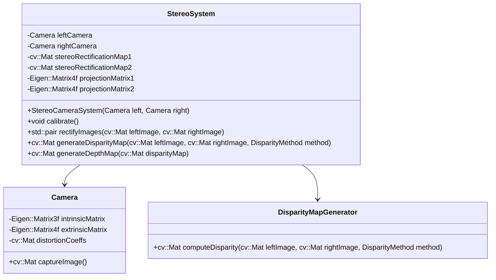

# Stereo Camera and 3D Point Cloud

## Task Description
Establish a stereo camera system for generating a real-time depth-map and 3D point cloud.

## Guide
### 1. Establish a stereo camera system
### 2. Calibrate the cameras as a stereo system
Use OpenCV stereo camera calibration tools.

Refer to: https://github.com/opencv/opencv/blob/master/samples/cpp/stereo_calib.cpp

### 3. Create stereo images and generate feature pairs
There are lots of works to do:

- Compensate the distortion from lens
- Utilizing with epipolar geometry
- Generating projection matrix with `cv::stereoRectify()`

Find the same feature point in left/right image.

### 4. Generating disparity map
Calculate disparity from the matches.

Addition: You can try `cv::StereoBM()` and `cv::StereoSGBM()` for comparison.

Refer to: https://github.com/opencv/opencv/blob/master/samples/cpp/stereo_match.cpp

### 5. Calculate depth map
Calculate depth from disparity with `cv::reprojectImageTo3D()`

## Extension Task
1. Create a 3D point cloud
2. Improve accuracy/quality of depth map
3. Try other algorithms to improve speed/accuracy/quality of depth map

## Process
1. Calibrate the stereo camera (using MATLAB)
   1. Intrinsic matrices $\mathbf{K}_L$ and $\mathbf{K}_R$
   2. Obtain the *fundamental matrix* $\mathbf{F}$ using the 8-point algorithm
   3. Compute the *essential matrix* $\mathbf{E}$
   4. Decompose the essential matrix $\mathbf{E}$ to get the *rotation matrix* $\mathbf{R}$ and the *translation vector* $\mathbf{t}$ ($\mathbf{p}_R^C = \mathbf{R}\mathbf{p}_L^C+\mathbf{t}$)
2. Rectify the stereo camera (lens undistortion and stereo rectification)
3. Stereo matching (correspondence pair search on the same image row)
   1. Block matching (BM)
   2. Semi-global block matching (SGBM)
4.  Disparity map (left and right image), optimization and refinement
5.  Triangulation to get the 3D point cloud

## Debug Images
1. Original images
2. Rectified images
3. Disparity map
4. Depth map
5. 3D point cloud
6. 3D point cloud with color

## UML

## References
- [HBVCAM-W202011HD V33](https://detail.1688.com/offer/753903056520.html)
- [Open Stereo Camera with OpenCV](https://zhaoxuhui.top/blog/2018/12/03/OpenSteroCameraWithOpenCV.html)
- [Stereo Camera Calibration (from MATLAB to OpenCV)](https://zhuanlan.zhihu.com/p/153329285)
- [Stereo Camera Calibration](https://www.cnblogs.com/champrin/p/17034043.html)
- [Depth Map in Stereo Matching](https://www.cnblogs.com/riddick/p/8486223.html)
- [cv::reprojectTo3D](https://blog.csdn.net/Gordon_Wei/article/details/86319058)
- [PCL Segmentation Fault](https://blog.csdn.net/weixin_45802055/article/details/131194547)
- [Middlebury Dataset](https://vision.middlebury.edu/stereo/data/)
- [Challenges of Stereo Matching](https://blog.csdn.net/He3he3he/article/details/101148558)